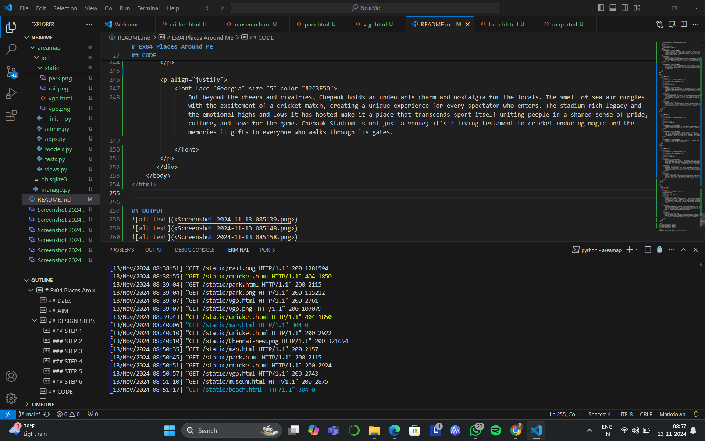

# Ex04 Places Around Me
## Date: 

## AIM
To develop a website to display details about the places around my house.

## DESIGN STEPS

### STEP 1
Create a Django admin interface.

### STEP 2
Download your city map from Google.

### STEP 3
Using ```<map>``` tag name the map.

### STEP 4
Create clickable regions in the image using ```<area>``` tag.

### STEP 5
Write HTML programs for all the regions identified.

### STEP 6
Execute the programs and publish them.

## CODE
map.html
```
<html>
    <head>
        <title>My City</title>
    </head>
    <body>
        <h1 align="center">
            <font color="SlateGray"><b>Chennai</b></font>
        </h1>
        <h3 align="center">
            <font color="coral"><b>A.Ranen Joseph Solomon (24006171)</b></font>
        </h3>
        <center>
            <hr size="3" color="black">
            <p align="justify">
            <font face="Georgia" size="5">
                Chennai is where culture thrives in every street corner, a city that celebrates art, music, and tradition with pure joy. Its people stand united, always ready to join hands in times of need. Cricket finds a passionate home here, with the Chepauk Stadium roaring to life with every boundary. The city flavors are unforgettable—from the rich aroma of filter coffee to the mouth-watering dosas and spicy biryanis. And then there is Marina Beach, stretching endlessly, where sunsets paint the sky and life slows down for a moment, reminding you that Chennai is more than a city; it is a feeling.
            </font>
            </p>
            <map name="MyCity">
                <area shape="rect" coords="100,100,900,900" href="exmap.html" title="My Journey across ages">
            </map>
            
            <map name="image-map">
                <area target="_blank" alt="Childrens Park" title="Childrens Park" href="park.html" coords="1429,539,1593,586" shape="rect">
                <area target="_blank" alt="MA Chidambaram Stadium" title="MA Chidambaram Stadium" href="cricket.html" coords="1426,286,1624,334" shape="rect">
                <area target="_blank" alt="Marina Beach" title="Marina Beach" href="beach.html" coords="1585,339,1756,383" shape="rect">
                <area target="_blank" alt="VGP Universal Kingdom" title="VGP Universal Kingdom" href="vgp.html" coords="1463,829,1727,893" shape="rect">
                <area target="_blank" alt="Chennai Railway Museum" title="Chennai Railway Museum" href="museum.html" coords="1373,181,1133,128" shape="rect">
            </map>
        </center>
    </body>
</html>
```

beach.html
```
<html>
    <head>
        <title>My City</title>
    </head>
    <body bgcolor="#2C3E38">
        <h1 align="center">
            <font color="#F4E1C1"><b>  The Journey through Ages</b></font>
        </h1>
        <h3 align="center">
            <font color="#F4E1C1"><b>Marina Beach</b></font>
        </h3>
        <hr size="3" color="#F4E1C1">
        <div align="center">
            
        </div>
       <div align="center">
        <p align="justify">
            <font face="Georgia" size="5" color="#E0E0E0">
                Marina Beach, Chennai’s crown jewel, stretches along the Bay of Bengal, offering a vibrant blend of nature, culture, and history. As the longest urban beach in India, it is a place where the gentle waves kiss the shore while the bustling city hums in the background. The golden sands are dotted with families, joggers, and street vendors, making it a lively spot where life moves at a relaxed pace. Whether it’s watching a breathtaking sunrise or enjoying a peaceful evening breeze, Marina Beach provides a sanctuary of calm amidst the city's hustle.
        </p>
        <p align="justify">
            <font face="Georgia" size="5" color="#E0E0E0">
                The beach is more than just a scenic escape; it is a cultural hub that brings people from all walks of life together. The iconic statues along the promenade, including those of political leaders and freedom fighters, serve as a reminder of the city's rich history. Locals and tourists alike enjoy evening strolls, with food carts offering delicious snacks like roasted peanuts and spicy corn. The air is filled with the sounds of the sea, laughter, and the occasional distant whistle of a fisherman, making it a place that evokes nostalgia and warmth.
            </font>
        </p>
        <p align="justify">
            <font face="Georgia" size="5" color="#E0E0E0">
                For many, Marina Beach is a cherished memory, a place where time slows down and life's simplest pleasures come alive. From children flying kites to couples watching the sunset, every corner of the beach holds a story. As the night falls, the beach transforms into a sparkling wonderland with brightly lit stalls and the cool breeze making the experience even more magical. Marina Beach is not just a destination; it’s a living, breathing part of Chennai’s soul, capturing the heart of every visitor who walks along its shores.
            </font>
        </p>
       </div>   
    </body>
</html>
```
vgp.html
```
<html>
    <head>
        <title>My City</title>
    </head>
    <body bgcolor="#46344E">
        <h1 align="center">
            <font color="#F8F8F8"><b>  The Journey through Ages</b></font>
        </h1>
        <h3 align="center">
            <font color="#F8F8F8"><b>VGP Universal Kingdom</b></font>
        </h3>
        <hr size="3" color="#F8F8F8">
        <div align="center">
            
        </div>
       <div align="center">
        <p align="justify">
            <font face="Georgia" size="5" color="#B8A7C3">
                VGP, a name that has etched itself into Chennais cultural landscape, is more than just an amusement park; it is a haven where joy, adventure, and nostalgia converge. Nestled along the serene East Coast Road, VGP offers an eclectic mix of thrilling rides, sprawling gardens, and unforgettable experiences. From the adrenaline rush of roller coasters to the peaceful strolls amidst the lush greenery, it is a place where every corner promises a new story, and every visit feels like a delightful escape from the everyday.
        </p> 
        <p align="justify">
            <font face="Georgia" size="5" color="#B8A7C3">
                But VGP is not just about entertainment—it is a treasure trove of memories for families, friends, and children alike. The vibrant, colorful atmosphere of the park, with its whimsical architecture and larger-than-life statues, evokes a sense of magic, almost as if you have stepped into a different world. The sound of laughter blends with the music of playful rides, and the delicious aroma of snacks in the air invites you to indulge in some of the best street food in the city. Whether it's the excitement of a bumper car ride or the peaceful serenity of the beach view from the parks edge, VGP offers a beautiful blend of excitement and tranquility.
            </font>
        </p>
        <p align="justify">
            <font face="Georgia" size="5" color="#B8A7C3">
                VGP is also a reflection of Chennais dynamic spirit, a place where history and modernity come together. From the early days as a modest family-run resort to its present stature as one of the citys premier attractions, VGP has stood as a symbol of growth, creativity, and resilience. It is not just a park; it is a living, breathing entity that continues to evolve, adding new attractions, events, and experiences for every generation. Every visit to VGP is a chance to relive childhood memories while creating new ones, making it a timeless gem that holds a special place in the hearts of all who enter its gates.
            </font>
        </p>
       </div>   
    </body>
</html>
```

park.html
```
<html>
    <head>
        <title>My City</title>
    </head>
    <body bgcolor="#D8E3DC">
        <h1 align="center">
            <font color="#3B3B3B"><b>  The Journey through Ages</b></font>
        </h1>
        <h3 align="center">
            <font color="#3B3B3B"><b>Children's Park</b></font>
        </h3>
        <hr size="3" color="#3B3B3B">
        <div align="center">
            
        </div>
       
        <p align="justify">
            <font face="Georgia" size="5" color="#B89F74">
                One of my most cherished and vivid memories from childhood takes me back to the Childrens Park in Chennai. It was a day filled with laughter and excitement as my dad, my sister, and I explored every corner of the park. But little did I know, while lost in the fun of the rides, I would soon feel a mix of fear and bravery that I would never forget.
            </font>
        </p>
        
        <p align="justify">
            <font face="Georgia" size="5" color="#B89F74">
                As I joyfully ran from one ride to the next, I suddenly realized I had wandered too far from my dad and sister. In an instant, the bustling park felt overwhelmingly huge, and panic set in. Tears welled up as I searched around, but my family was nowhere in sight. Yet, somehow, amidst the confusion, a spark of courage rose within me. Gathering my little 2nd-grade self together, I went straight to the entrance and confidently approached the police there. With all the determination I could muster, I explained that it was my parents who were missing, and I proudly shared their names and phone number, hoping they wouldd find their way back to me!
            </font>
        </p>
        <p align="justify">
            <font face="Georgia" size="5" color="#B89F74">
                Looking back, this memory is more than just a funny childhood story it is one of those precious, deeply ingrained moments that made Chennai Childrens Park feel magical and unforgettable.
            </font>
        </p>
    </body>
</html>
```

museum.html
```
<html>
    <head>
        <title>My City</title>
    </head>
    <body bgcolor="#B3D4E0">
        <h1 align="center">
            <font color="#003366"><b>  The Journey through Ages</b></font>
        </h1>
        <h3 align="center">
            <font color="#003366"><b>VGP Universal Kingdom</b></font>
        </h3>
        <hr size="3" color="#003366">
        <div align="center">
            
        </div>
       <div align="center">
        <p align="justify">
            <font face="Georgia" size="5" color="#444444">
                The Chennai Railway Museum, nestled in the heart of the city, offers a journey back in time to the golden age of railways in India. A hidden gem for history enthusiasts and curious travelers alike, this museum is a treasure trove of relics and stories that weave together the evolution of rail travel in the country. From vintage steam engines to old railway carriages, every exhibit here tells the tale of how railways played a pivotal role in shaping Indias growth. The atmosphere is one of nostalgia, where the clanking of metal and the hissing of steam come alive in the form of meticulously preserved pieces of history.
        </p>
        <p align="justify">
            <font face="Georgia" size="5" color="#444444">
                Stepping into the Chennai Railway Museum feels like embarking on a timeless voyage. The museum lush, sprawling grounds are home to some of the most iconic trains in Indian history, including the regal Maharajas express and the luxurious Shatabdi coaches. Kids can delight in the interactive exhibits, while adults can marvel at the stunning craftsmanship of the engines and carriages. The museum also features informative displays about the history of Indian railways, showcasing how it is intertwined with the countrys development. With each visit, the museum offers a fresh perspective on how railways have connected cities, people, and cultures across India.
            </font>
        </p>
        <p align="justify">
            <font face="Georgia" size="5" color="#444444">
                Beyond its historical importance, the Chennai Railway Museum is a tribute to the enduring spirit of travel. For many, it serves as a reminder of the excitement and adventure that rail journeys once represented. The enchanting charm of the museum, with its rustic old-world appeal, transports visitors to a bygone era where travel was not just about reaching a destination but about experiencing the joy of the journey itself. Whether you are a train enthusiast, a history buff, or someone seeking a quiet moment of reflection, the Chennai Railway Museum promises a fascinating experience that is as educational as it is captivating.
            </font>
        </p>
       </div>   
    </body>
</html>
```

cricket.html
```
<html>
    <head>
        <title>My City</title>
    </head>
    <body bgcolor="#F7E1E3">
        <h1 align="center">
            <font color="#333333"><b>  The Journey through Ages</b></font>
        </h1>
        <h3 align="center">
            <font color="#333333"><b>MA Chidambaram Stadium</b></font>
        </h3>
        <hr size="3" color="#333333">
        <div align="center">
            
        </div>
       <div align="center">
        <p align="justify">
            <font face="Georgia" size="5" color="#2C3E50">
                Chepauk Stadium, nestled along the coastline in Chennai, is more than just a cricket ground; it is a beloved monument of sportsmanship, legacy, and passion. Established in 1916, it is one of the oldest cricket stadiums in India, and its architecture and ambiance evoke the rich history of the game in the country. With its distinctive towering stands and lively atmosphere, the stadium comes alive every time a game is played here, resonating with the energy of countless fans who pour in to support their teams. Known as the home ground for Tamil Nadu's state team and the Chennai Super Kings in the IPL, Chepauk has witnessed numerous historic matches, including India Cricker team first-ever Test match win in 1952, making it a cherished venue for cricket lovers worldwide.
            </font>
        </p>
        <p align="justify">
            <font face="Georgia" size="5" color="#2C3E50">
                The heart of Chepauk Stadium is its crowd, known for their unwavering enthusiasm and undying loyalty to the sport. Spectators at Chepauk have seen legends come and go, from local icons like MS Dhoni to international stars who have left their mark on its grounds. When the stadium fills with roaring cheers, waves of yellow in support of the Super Kings, and rhythmic chants, there is an unmistakable spirit that electrifies the air. This passionate fanbase has turned Chepauk into a fortress, where cricketers are spurred on by the relentless encouragement of thousands of loyal fans.
            </font>
        </p>
        <p align="justify">
            <font face="Georgia" size="5" color="#2C3E50">
                But beyond the cheers and rivalries, Chepauk holds an undeniable charm and nostalgia for the locals. The smell of sea air mingles with the excitement of a cricket match, creating a unique experience for every spectator who enters. The stadium rich legacy and the emotional highs and lows it has hosted make it a place that transcends sport itself—uniting people in a shared sense of pride, culture, and love for the game. Chepauk Stadium is not just a venue; it's a living testament to cricket enduring magic and the memories it gifts to everyone who walks through its gates.
            </font>
        </p>
       </div>   
    </body>
</html>
```

## OUTPUT




## RESULT
The program for implementing image maps using HTML is executed successfully.
